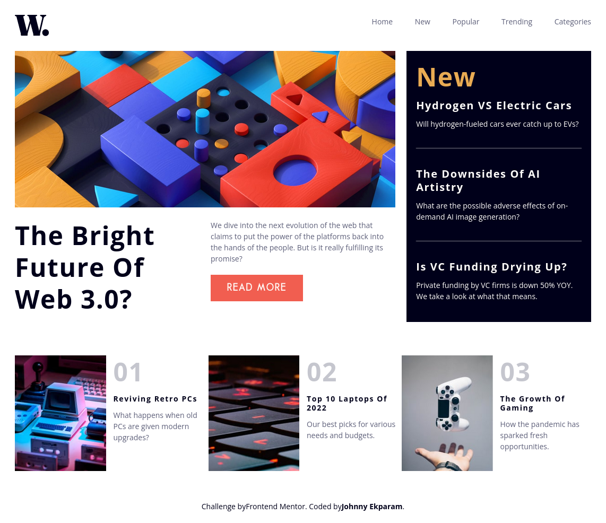
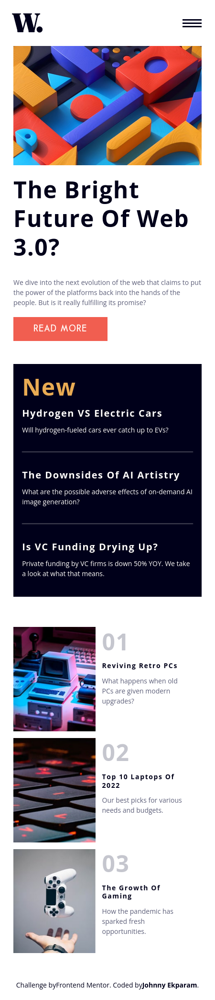

# Frontend Mentor - News homepage solution

This is a solution to the [News homepage challenge on Frontend Mentor](https://www.frontendmentor.io/challenges/news-homepage-H6SWTa1MFl). Frontend Mentor challenges help you improve your coding skills by building realistic projects.

## Table of contents

- [Overview](#overview)
  - [The challenge](#the-challenge)
  - [Screenshot](#screenshot)
  - [Links](#links)
- [My process](#my-process)
  - [Built with](#built-with)
  - [What I learned](#what-i-learned)
  - [Continued development](#continued-development)
  - [Useful resources](#useful-resources)
- [Author](#author)

## Overview

### The challenge

Users should be able to:

- View the optimal layout for the interface depending on their device's screen size
- See hover and focus states for all interactive elements on the page

### Screenshot



<!--  -->

### Links

- Solution URL: [Add solution URL here](https://your-solution-url.com)
- Live Site URL: [Add live site URL here](https://your-live-site-url.com)

## My process

### Built with

- Semantic HTML5 markup
- CSS custom properties
- Flexbox
- CSS Grid
- Mobile-first workflow

### What I learned

I learned how to use grid-template-areas to effectively and easily set and switch layouts for different screen sizes.
first structure the html markup

```html
<div class="main-grid main-cintainer">
	<section class="main-grid-elem"></section>
	<section class="main-grid-elem"></section>
	<section class="main-grid-elem"></section>
	<section class="main-grid-elem "></section>
	<section class="main-grid-elem"></section>
</div>
```

then set your display to grid and defined your grid-template-areas after which you'll need to select the grid child elements in their order.

```css
Css .main-grid {
	display: grid;
	gap: 1.5em;
	grid-auto-columns: 1fr;
	grid-template-areas:
		"one"
		"two"
		"three"
		"four"
		"five";
}

.main-grid-elem:nth-child(1) {
	grid-area: one;
}

.main-grid-elem:nth-child(2) {
	grid-area: two;
}

.main-grid-elem:nth-child(3) {
	grid-area: three;
}

.main-grid-elem:nth-child(4) {
	grid-area: four;
}

.main-grid-elem:nth-child(5) {
	grid-area: five;
}
```

finaly you can easiy change the look acording to your desired layout on different screen sizes

```css
@media screen and (min-width: 800px) {
	.main-grid {
		grid-template-areas:
			"one one four"
			"two three four"
			"five five five";
	}
}
```

### Continued development

Having using this project to refresh on my responsive web design knowlede, I will be working on newer projects with React.js and TypeScript, also doing some testing as well with Jest.

### Useful resources

- [Example resource 1](https://www.youtube.com/watch?v=rg7Fvvl3taU) - This video by Kelvin Powel helped me to understand alot about grid.

## Author

- Website - [Johnny Ekparam](https://johnnyekparam.netlify.app/)
- Frontend Mentor - [@cyber-jev](https://www.frontendmentor.io/profile/cyber-jev)
- Twitter - [@johnny_Jev](https://twitter.com/Johnny_Jev)
